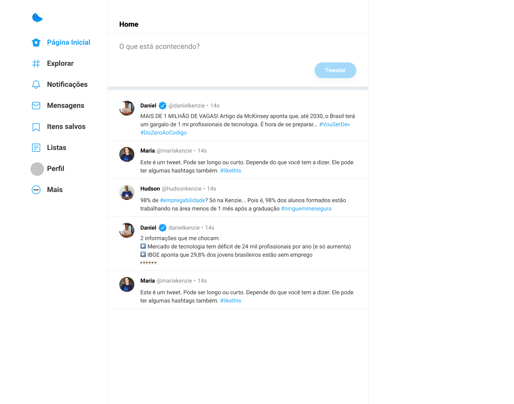

<h1 align="center"> Projeto Final Kenzie Ken-Te-Vi </h1>

Projeto desenvolvido na parte 3 da maratona de programação da Kenzie Academy Brasil. 

  <a href="#-tecnologias">Tecnologias</a>&nbsp;&nbsp;&nbsp;|&nbsp;&nbsp;&nbsp;
  <a href="#-projeto">Projeto</a>&nbsp;&nbsp;&nbsp;|&nbsp;&nbsp;&nbsp;
  <a href="#-layout">Layout</a>&nbsp;&nbsp;&nbsp;|&nbsp;&nbsp;&nbsp;
  <a href="#memo-licença">Licença</a>

  

 

  

## 🚀 Tecnologias

Esse projeto foi desenvolvido com as seguintes tecnologias:

- HTML e CSS
- JavaScript
- Git e Github

## 💻 Projeto

O Ken-Te-Vi é um projeto final de curso da Kenzie, usando como modelo o twitter.

- [Acesse o projeto finalizado, online](https://github.com/williamsramos/projeto-final-kenzie-Ken-Te-Vi)

## 🔖 Layout

- [Twitter](.github/preview.jpg)

## :memo: Licença

Esse projeto está sob a licença MIT.

---

Feito com ♥ by Kenzie